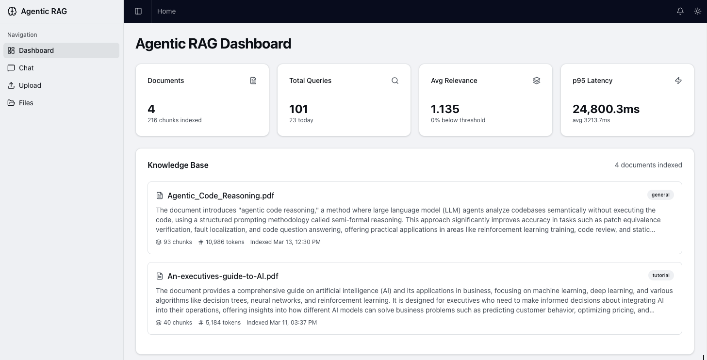
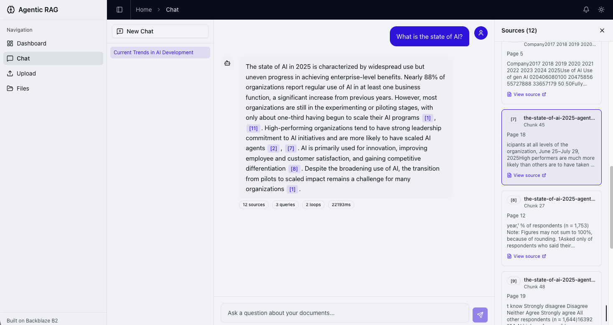

# Agentic RAG Vector 

A production-ready **Agentic RAG (Retrieval-Augmented Generation) ** for building AI-powered document Q&A systems.

## Screenshots

<p align="center">
  
</p>

<p align="center">
  
</p>


### Setup

**1. Install dependencies**

```bash
pnpm install
```

**2. Set up the backend**

```bash
cd services/api
python -m venv .venv && source .venv/bin/activate
pip install -r requirements.txt
cd ../..
```

**3. Add your B2 credentials**

Create a bucket and an application key in your [B2 dashboard](https://secure.backblaze.com/b2_buckets.htm?utm_source=github&utm_medium=referral&utm_campaign=ai_artifacts&utm_content=oss-starter) (the key needs `readFiles`, `writeFiles`, `deleteFiles` permissions), then:

```bash
cp .env.example .env
```

Fill in your `.env`:

```
# B2 storage (required)
B2_S3_ENDPOINT=https://s3.us-west-004.backblazeb2.com
B2_APPLICATION_KEY_ID=your-key-id
B2_APPLICATION_KEY=your-key
B2_BUCKET_NAME=your-bucket

# LLM + Embeddings: one API key for everything (default: OpenAI)
OPENAI_API_KEY=your-openai-key
```

That's the minimum. By default, OpenAI handles both chat (gpt-4o) and embeddings (text-embedding-3-small).

To use Anthropic Claude for chat instead, add:

```
ANTHROPIC_API_KEY=your-anthropic-key
LLM_PROVIDER=anthropic
LLM_MODEL=claude-sonnet-4-20250514
```

See `.env.example` for all options including `LANCEDB_URI`, `CHUNK_SIZE`, and `MAX_CHUNKS_PER_DOC`.

**4. Run it**

```bash
pnpm dev
```

That's it. Frontend at `localhost:3000`, API at `localhost:8000`. Upload a document and ask it questions in the Chat page.


## Core Features

- [Chat UI](docs/features/chat.md): streaming responses with citations and live pipeline step visualization
- [Agentic Retrieval](docs/features/agentic-retrieval.md): multi-step RAG pipeline with intent routing, query rewriting, hybrid search, cross-encoder reranking, CRAG, and evidence validation
- [Document Pipeline](docs/features/document-pipeline.md): recursive or semantic chunking, classification, summarization, contextual enrichment, embedding
- [File Upload](docs/features/file-upload.md): drag-and-drop upload with real-time progress and RAG processing
- [File Browser](docs/features/file-browser.md): list, preview, download, delete files
- [Dashboard](docs/features/dashboard.md): session analytics with RAGAS evaluation scores, retrieval quality, agent behavior metrics
- [Metadata Extraction](docs/features/metadata-extraction.md): image dimensions, EXIF, PDF info, checksums
- Structural tests: verify layering rules, import boundaries, SDK containment, file size limits
- Structured JSON logging: every request traced with `request_id` and timing
- `/health` endpoint: B2 connectivity check
- `/metrics` endpoint: Prometheus-format counters (request count, latency, uploads)

## Tech Stack

- TypeScript, Next.js 16, React 19, Tailwind v4, shadcn/ui, Recharts
- Python 3.11+, FastAPI, Pydantic v2, Pillow, PyPDF2, sentence-transformers
- LanceDB (vector store on S3/B2 with hybrid BM25 + dense search), LangChain (LLM orchestration)
- Cross-encoder reranking (ms-marco-MiniLM-L-6-v2, CPU-friendly)
- OpenAI (default for chat + embeddings) or Anthropic Claude (optional for chat)
- pnpm workspaces (monorepo)
